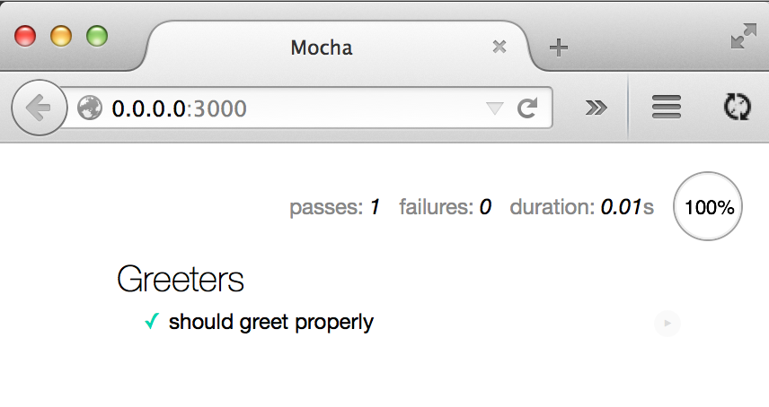
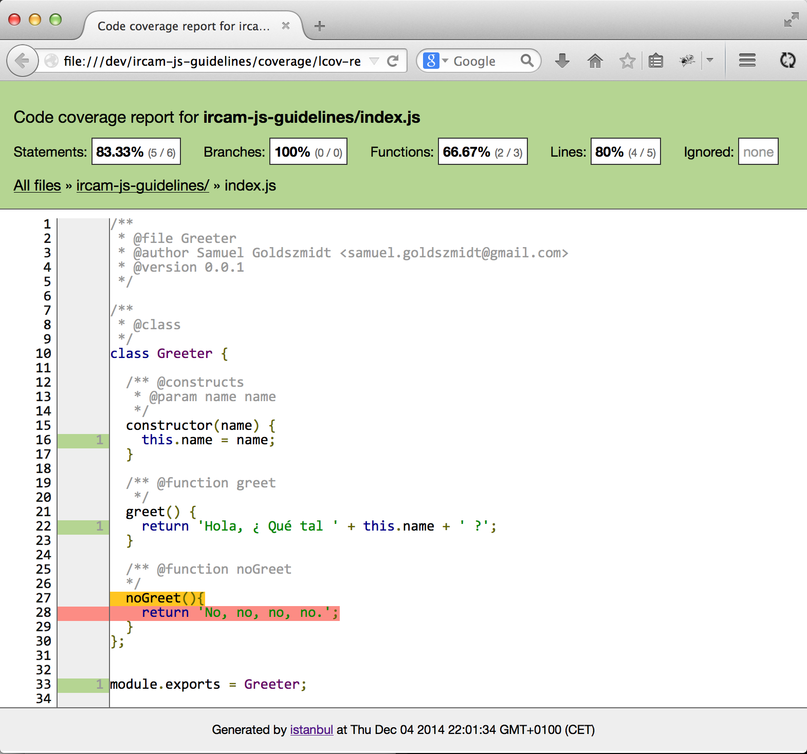

Ircam JavaScript Guidelines
===========================

For Ircam Javascript open source projects, you should put your project on the [Ircam-RnD GitHub](https://github.com/Ircam-RnD).

To be adopted and re-used you should:

1. Adopt coding conventions
2. Provide a documentation and online examples (especially for audio processing where these examples serve as audio integration tests)
3. Propose [unit tests](http://en.wikipedia.org/wiki/Unit_testing) and [code coverage](http://en.wikipedia.org/wiki/Code_coverage) information

1. JavaScript version and coding style
--------------------------------------

[sublimetext](http://www.sublimetext.com/) is often used as text editor for JavaScript programs.

You can write JavaScript code using EcmaScript 6 (also known as harmony) version of the standard. But, as this version is not yet implemented on every major browser, you need a tool to convert it back to EcmaScript 5. For this purpose you can use [Traceur](https://github.com/google/traceur-compiler).

To track if a web standard you want to use is implemented on a specific browser, consult [caniuse.com](http://caniuse.com/). As a fallback, you will certainly find some [Polyfill](http://fr.wikipedia.org/wiki/Polyfill) online.

For coding style purposes, [jslint](http://www.jslint.com) is a good tool to begin with.

You should take a look at [node](http://nodejs.org/), this will certainly help you to write reusable JavaScript code (see also [commonjs](http://www.commonjs.org/])).


2. Documentation and examples
-----------------------------

In order of importance:

1. Put a README.md file in [Markdown format](http://daringfireball.net/projects/markdown/syntax) in the root directory and explain goals of the library and public API, and a LICENSE file in the root directory of your repository. For open-source project you can use the BSD 3-clause.
2. Document source code following [JSDoc3](http://usejsdoc.org/) format.
3. Provide working examples
    * Create an ```examples``` folder, and users should be able to clone your GitHub repo, start a server in the root directory of the project (```python -m SimpleHTTPServer```) and go to url ```http://0.0.0.0:8000/examples``` to see working examples.
    * For projects published on GitHub, you should consider using the [gh-pages](https://pages.github.com/) to have an online demo directly available.
4. Write general documentation:
    * Create a ```docs``` folder in the root directory of your project.
    * Write markdown files inside.
    * For advanced documentation, you could take a look at [Jehyll](http://jekyllrb.com/)


3. Tests and coverage
---------------------

A large unit test suite and code coverage information are a must have for maintenable software and will encourage other open source developers to propose you [Pull Request](https://help.github.com/articles/using-pull-requests/). You should also use [Semantic Versioning](http://semver.org/)

*Unit tests*

These tests can be done using [mocha](http://mochajs.org/).

We state here that you have written JavaScript code using (node modules)[http://nodejs.org/api/modules.html].

Tests can be run in node or in the browser. If you use the Web Audio API, you should test you code in the browser as node doesn't provide an implementation for the Web Audio API.

Be careful, if you use Traceur to convert JavaScript ES6 to ES5, you must use [mocha-traceur](https://www.npmjs.org/package/mocha-traceur) to enable mocha to work directly with our ES6 source code file (index.js).

Have a look at the test file in ```test/test.js```.
Run the test
    * in node by using: ``mocha --compilers js:mocha-traceur test/test.js```
    * in browser:
        If you don't want to deal with coverage (but you know you should), an easy way to test your files in browser is to use [browserify](http://browserify.org/). You 'browserify' your tests files, an use mocha in-browser testing. As you write ES6 code, you need to use (es6ify)[https://github.com/thlorenz/es6ify] transform.
        ```
        mocha init browser-test // create a default folder for in browser tests
        ```
        Then run the following code which fill the browser-test/tests.js file with an es6 version of your original tests (initially: test/tests.js)
        ```
          browserify()
            .add(es6ify.runtime)
            .transform(es6ify)
            .requir e('./test/test.js', {
              entry: true
            })
            .bundle()
            .on('error', function(err) {
              console.error(err);
            })
            .pipe(fs.createWriteStream("./browser-test/tests.js"));
        ```
        Last run the test in a browser.
        ```
        python -m SimpleHTTPServer // and visit 0.0.0.0:8000 with a browser
        ```

*Coverage*

    * in node:
        use [istanbul-traceur](https://www.npmjs.org/package/istanbul-traceur)
        and the proposed [gulp](http://gulpjs.com/) task in its README.
    * in browser, see testsAndCoverage.js file,
    ```
    node testsAndCoverage.js
    ```



